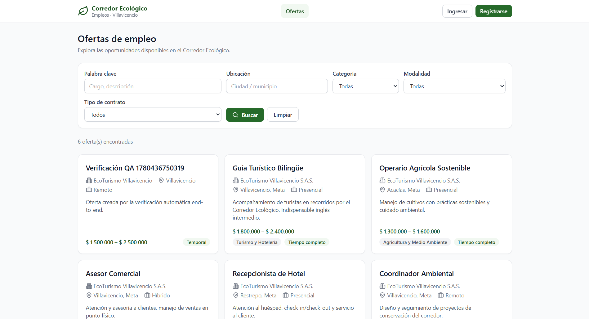
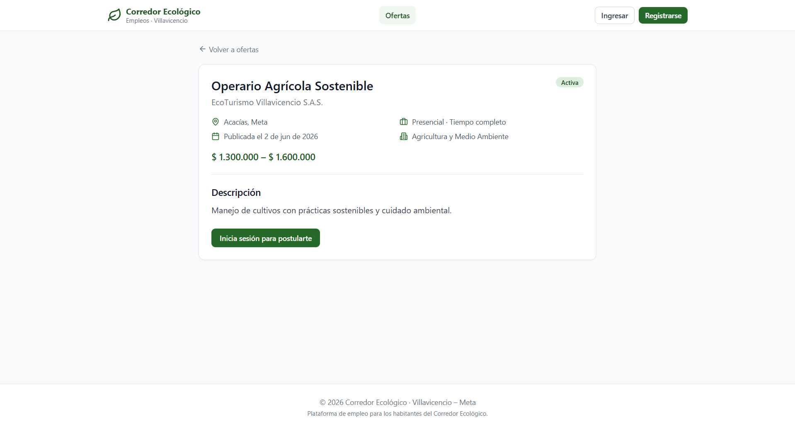
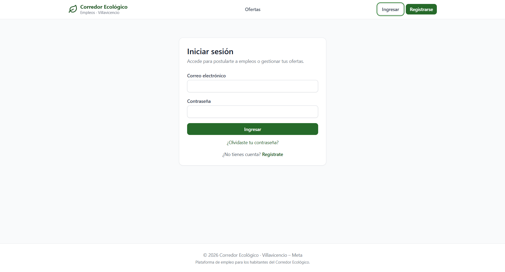
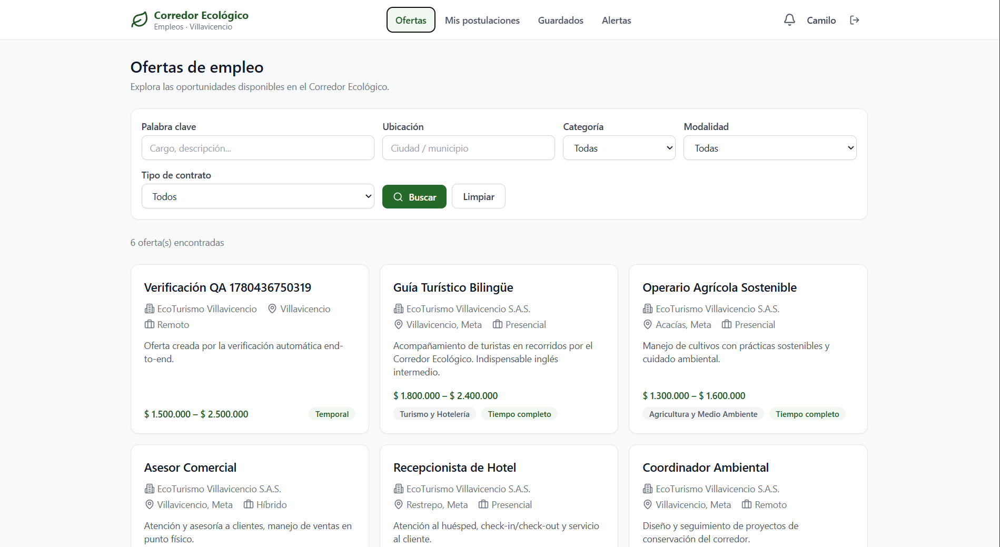

# Plataforma de Empleo — Corredor Ecológico (Villavicencio)

Aplicación web full‑stack que conecta a candidatos y empleadores del **Corredor
Ecológico de Villavicencio – Meta**, permitiendo publicar ofertas, postularse,
gestionar procesos de contratación y administrar la plataforma.

Versión **3.0** — modernización integral: segura, observable, contenedorizada y
lista para producción.

# Vista de la aplicación






---

## Novedades de la v3.0

La v3.0 evoluciona la base sólida de la v2 (TypeScript de extremo a extremo,
arquitectura por capas, SQL parametrizado) hacia una plataforma de producción:

- **Seguridad de sesión**: access token corto + **refresh token con rotación y
  detección de reuso**, cierre de sesión real (revocación), **bloqueo de cuenta**
  por intentos fallidos y **recuperación de contraseña**.
- **Trazabilidad**: **auditoría** de acciones sensibles y **borrado lógico**
  (soft‑delete) de usuarios y ofertas.
- **Observabilidad**: **logging estructurado (pino)** con `request-id` y códigos
  de error legibles por máquina.
- **Nuevas funcionalidades**: **empleos guardados**, **alertas de empleo**,
  **mensajería** empleador↔candidato, **correo transaccional** y **páginas
  públicas de empresa**.
- **DevOps**: **Docker + docker‑compose**, **CI con GitHub Actions**, `package.json`
  raíz de orquestación, **husky + lint‑staged** y plantillas de entorno de
  producción.

---

## Características

- **Autenticación y roles** (candidato, empleador, admin) con JWT, **refresh
  tokens rotatorios**, recuperación de contraseña y bloqueo por fuerza bruta.
- **Ofertas de empleo**: CRUD completo, **búsqueda y filtros** (palabra clave,
  categoría, empleador, ubicación, modalidad, tipo de contrato) y **paginación**.
- **Postulaciones** con **estados** (enviada, en revisión, preseleccionado,
  rechazado, aceptado) y **mensajería** dentro de cada postulación.
- **Empleos guardados** (favoritos) y **alertas** que avisan de nuevas ofertas
  coincidentes (in‑app + correo).
- **Perfiles** de candidato (con habilidades) y de empleador, con **páginas
  públicas de empresa**.
- **Notificaciones in‑app y por correo** (bienvenida, nueva postulación, cambio
  de estado, alertas, recuperación de contraseña).
- **Panel administrativo**: métricas, gestión de usuarios/ofertas/categorías y
  **registro de auditoría**.
- **Seguridad**: Helmet, CORS configurable, rate limiting, RBAC, verificación de
  propiedad, borrado lógico y auditoría.
- **Interfaz moderna, responsive y accesible** con identidad visual verde
  (Tailwind CSS) y _error boundary_ global.
- **API REST documentada** con Swagger UI.

---

## Stack tecnológico

| Capa | Tecnologías |
|------|-------------|
| **Frontend** | React 18 · TypeScript · Vite · Tailwind CSS · React Router · TanStack Query · React Hook Form · Zod |
| **Backend** | Node.js · Express 4 · TypeScript · arquitectura por capas (rutas → controlador → servicio → repositorio) |
| **Base de datos** | MySQL / MariaDB (`mysql2`, SQL parametrizado, esquema normalizado 3FN) |
| **Auth / Seguridad** | JWT + refresh tokens · bcryptjs · Helmet · CORS · express-rate-limit |
| **Observabilidad** | pino + pino-http (logs estructurados con request-id) |
| **Correo** | nodemailer (SMTP configurable) |
| **Pruebas** | Vitest · Supertest · Testing Library |
| **DevOps** | Docker · docker-compose · GitHub Actions · husky · lint-staged |
| **Docs** | Swagger UI (OpenAPI 3) |

---

## Estructura del proyecto

```
employment-web-platform/
├── package.json             # Orquestación (scripts dev/build/test/lint/docker) — NO gestiona deps
├── docker-compose.yml       # MySQL + backend + frontend (nginx)
├── .github/workflows/ci.yml # CI: lint · typecheck · test · build
├── backend/                 # API REST (Express + TypeScript)
│   ├── Dockerfile
│   └── src/
│       ├── config/          # env (Zod), pool MySQL, logger (pino)
│       ├── constants/       # enums del dominio + parámetros de seguridad
│       ├── db/              # schema.sql, migraciones, seed, runner
│       ├── middleware/      # auth, authorize (RBAC), validate, httpLogger, errores
│       ├── modules/         # auth, users, profiles, jobs, applications,
│       │                    #   notifications, categories, admin, audit,
│       │                    #   saved-jobs, alerts, email, messages
│       │                    #   (routes · controller · service · repository · validation)
│       ├── utils/           # AppError, jwt, tokens, password, paginación
│       ├── app.ts           # ensamblado de Express
│       └── server.ts        # arranque
├── frontend/                # SPA (React + Vite + Tailwind)
│   ├── Dockerfile · nginx.conf
│   └── src/
│       ├── api/             # cliente axios (refresh automático) + servicios
│       ├── components/      # ui/, layout/ (incl. ErrorBoundary), jobs/, ...
│       ├── context/         # AuthProvider
│       ├── pages/           # públicas, candidate/, employer/, admin/
│       └── lib/             # utilidades (formato, cn)
├── docs/                    # ARQUITECTURA · BASE_DE_DATOS · API
└── README.md
```

---

## Requisitos previos

- **Node.js 18+** y npm (probado con Node 20/24).
- **MySQL o MariaDB** (se recomienda **XAMPP** en Windows) **o Docker** (incluye MySQL).

---

## Puesta en marcha

### Opción A — Local (XAMPP/MySQL)

```bash
# 1) Instalar dependencias (ambos paquetes)
npm run setup          # = npm install (raíz) + install en backend y frontend

# 2) Configurar entorno del backend
cd backend && cp .env.example .env && cd ..
#   Ajusta JWT_SECRET (>= 32 chars). Genera uno con:
#   node -e "console.log(require('crypto').randomBytes(48).toString('hex'))"

# 3) Crear la BD y datos de ejemplo (con MySQL en ejecución)
npm run db:setup       # migraciones + seed

# 4) Levantar backend (:4000) y frontend (:5173) a la vez
npm run dev
```

Abre **http://localhost:5173**. La documentación de la API está en
**http://localhost:4000/api/docs**.

> Los comandos por paquete siguen disponibles (`npm run dev --prefix backend`,
> etc.). El `package.json` raíz solo orquesta; cada paquete gestiona sus
> dependencias con su propio `package-lock.json`.

### Opción B — Docker

```bash
cp .env.docker.example .env        # define al menos JWT_SECRET
docker compose up --build          # MySQL + backend + frontend (nginx)
# Frontend en http://localhost:8080  ·  API proxyada en /api
# Datos demo: docker compose exec backend node dist/db/seed.js
```

---

## Comandos (desde la raíz)

| Comando | Acción |
|---------|--------|
| `npm run dev` | Backend (:4000) + frontend (:5173) en paralelo |
| `npm run build` | Compila backend y frontend |
| `npm run typecheck` / `npm run lint` | Verificación de tipos / ESLint en ambos |
| `npm test` | Pruebas de backend y frontend |
| `npm run db:setup` / `db:migrate` / `db:seed` / `db:reset` | Base de datos |
| `npm run docker:up` / `docker:down` | Orquestación con Docker |

> Las pruebas de integración del backend requieren MySQL; si no está disponible
> se omiten automáticamente. Las unitarias y de frontend no necesitan BD.

---

## Credenciales de ejemplo (tras `db:seed`)

| Rol | Correo | Contraseña |
|-----|--------|------------|
| Administrador | `admin@corredorempleo.co` | `Admin1234*` |
| Empleador | `empleador@corredorempleo.co` | `Empleador123*` |
| Candidato | `candidato@corredorempleo.co` | `Candidato123*` |

> Cambia estas credenciales en cualquier despliegue real.

---

## Variables de entorno (backend)

Las claves se validan con Zod al arrancar (la app no inicia si faltan/ son
inválidas). Ver `backend/.env.example` y `backend/.env.production.example`.

| Variable | Descripción |
|----------|-------------|
| `JWT_SECRET` | Secreto JWT (≥ 32 caracteres). **Obligatorio.** |
| `JWT_EXPIRES_IN` / `REFRESH_TOKEN_DAYS` | Vigencia del access token / refresh token |
| `DB_*` | Conexión MySQL (`DB_HOST=127.0.0.1` en XAMPP) |
| `CORS_ORIGIN` | Origen(es) del frontend (coma-separado) |
| `APP_URL` | URL pública del frontend (enlaces de correo) |
| `LOG_LEVEL` | Nivel de log de pino |
| `SMTP_*` / `MAIL_FROM` | Correo transaccional (sin SMTP, en dev se loguea) |
| `ADMIN_*` | Administrador inicial creado por el seed |

**Frontend**: `VITE_API_URL` (inyectada en build). Ver `frontend/.env.production.example`.

---

## Visión general de la API

Base: `http://localhost:4000/api/v1` — documentación interactiva en `/api/docs`.

| Recurso | Endpoints destacados |
|---------|----------------------|
| **Auth** | `POST /auth/register` · `login` · `refresh` · `logout` · `forgot-password` · `reset-password` · `GET /auth/me` |
| **Ofertas** | `GET /ofertas` (filtros) · `GET /ofertas/:id` · `POST/PATCH/DELETE` · `GET /ofertas/mine` · `GET /ofertas/:id/applications` |
| **Postulaciones** | `POST /postulaciones` · `GET /postulaciones/mine` · `PATCH /:id/status` · `DELETE /:id` |
| **Guardados** | `GET /guardados` · `GET /guardados/ids` · `POST/DELETE /guardados/:id` |
| **Alertas** | `GET /alertas` · `POST /alertas` · `DELETE /alertas/:id` |
| **Mensajes** | `GET /mensajes/:idPostulacion` · `POST /mensajes/:idPostulacion` |
| **Perfiles** | `GET/PUT /perfiles/candidate/me` · `GET/PUT /perfiles/employer/me` · `GET /perfiles/employer/:id` (público) |
| **Notificaciones** | `GET /notificaciones` · `unread-count` · `PATCH /:id/read` |
| **Admin** | `GET /admin/stats` · `GET /admin/ofertas` · `GET /admin/auditoria` · `GET /usuarios` |

Detalle completo en [`docs/API.md`](docs/API.md).

---

## Despliegue

**Con Docker** (recomendado): define las variables en un `.env` (ver
`.env.docker.example`, sobre todo `JWT_SECRET` y `CORS_ORIGIN`) y ejecuta
`docker compose up --build`. nginx sirve el frontend y proxya `/api` al backend;
el backend aplica migraciones al arrancar.

**Manual**: aprovisiona MySQL y define `DB_*`; en el backend `npm run build` +
`npm start` con `NODE_ENV=production`, `JWT_SECRET` fuerte y `CORS_ORIGIN` real
(ejecuta `npm run db:migrate`); en el frontend `npm run build` y sirve `dist/`
detrás de un servidor estático/CDN con `VITE_API_URL` apuntando a la API. Usa un
gestor de procesos (PM2/systemd) o el contenedor para el reinicio automático.

> **Nota de seguridad**: las vulnerabilidades reportadas por `npm audit`
> corresponden a herramientas de desarrollo (vitest/vite/esbuild) y no afectan
> el runtime de producción.

---

## Documentación adicional

- [Arquitectura](docs/ARQUITECTURA.md) — capas, flujo de petición, seguridad y observabilidad.
- [Base de datos](docs/BASE_DE_DATOS.md) — modelo entidad‑relación y migraciones.
- [Referencia de API](docs/API.md) — endpoints, parámetros y permisos.

---

## Solución de problemas

| Problema | Causa probable / solución |
|----------|---------------------------|
| `db: false` en `/health` o error 503 | MySQL no está activo. Inicia el módulo MySQL en XAMPP. |
| `Variables de entorno inválidas` al arrancar | Falta `.env` o `JWT_SECRET` (mínimo 32 caracteres). |
| `ER_ACCESS_DENIED_ERROR` | Usuario/contraseña de `DB_*` incorrectos. |
| CORS bloqueado en el navegador | Ajusta `CORS_ORIGIN` con la URL del frontend. |
| La sesión se cierra sola | Revisa que el frontend conserve el refresh token; un 401 tras fallar el refresh cierra sesión. |
