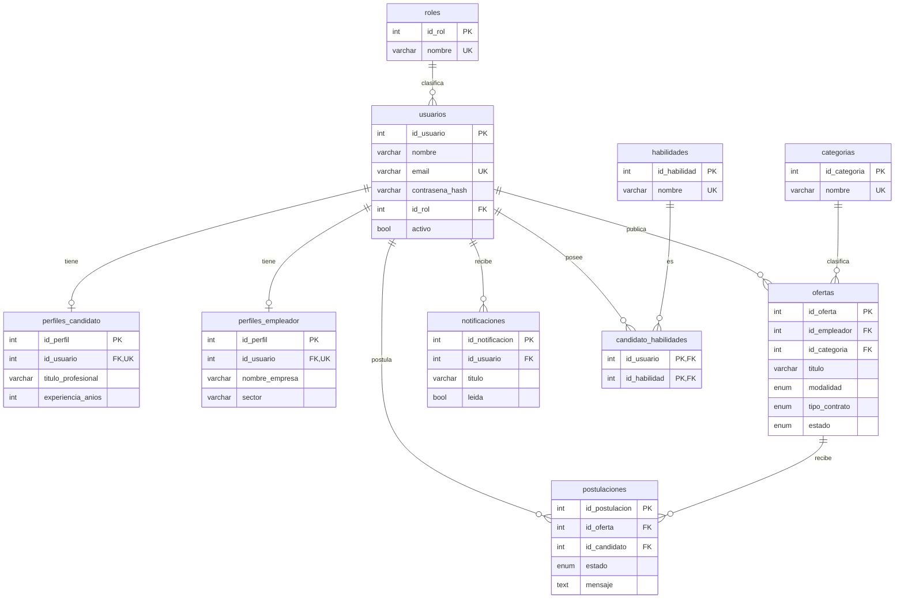

# Base de datos

Motor **InnoDB** (claves foráneas + transacciones), codificación `utf8mb4`.
Esquema normalizado hasta **3FN**. Definición en
[`backend/src/db/schema.sql`](../backend/src/db/schema.sql) y en las migraciones de
[`backend/src/db/migrations/`](../backend/src/db/migrations/).

## Diagrama entidad‑relación

## Tablas

| Tabla | Descripción | Relaciones clave |
|-------|-------------|------------------|
| `roles` | Catálogo de roles (`admin`, `empleador`, `candidato`). | 1:N → `usuarios` |
| `usuarios` | Cuentas. `email` único, contraseña hasheada, `activo`. | N:1 → `roles` |
| `perfiles_candidato` | Datos del candidato (1:1 con usuario). | 1:1 → `usuarios` (CASCADE) |
| `perfiles_empleador` | Datos de la empresa (1:1 con usuario). | 1:1 → `usuarios` (CASCADE) |
| `habilidades` | Catálogo de habilidades. | N:M con `usuarios` |
| `candidato_habilidades` | Relación N:M candidato ↔ habilidad. | PK compuesta (CASCADE) |
| `categorias` | Catálogo de categorías de empleo. | 1:N → `ofertas` |
| `ofertas` | Ofertas laborales. ENUM de modalidad, contrato y estado. | N:1 → `usuarios`, `categorias` |
| `postulaciones` | Postulaciones con estado. **Única** `(id_oferta, id_candidato)`. | N:1 → `ofertas`, `usuarios` |
| `notificaciones` | Avisos in‑app por usuario. | N:1 → `usuarios` (CASCADE) |
| `tokens_sesion` | Refresh tokens (hash SHA‑256) con rotación y detección de reuso. | N:1 → `usuarios` (CASCADE) |
| `tokens_recuperacion` | Tokens de recuperación de contraseña (hash, un solo uso). | N:1 → `usuarios` (CASCADE) |
| `auditoria` | Registro de acciones sensibles (actor, acción, entidad, detalle JSON). | N:1 → `usuarios` (SET NULL) |
| `empleos_guardados` | Favoritos: relación N:M candidato ↔ oferta. | PK compuesta (CASCADE) |
| `alertas_empleo` | Criterios de alerta (palabra clave/categoría/modalidad) por candidato. | N:1 → `usuarios`, `categorias` |
| `mensajes` | Mensajería dentro de una postulación. | N:1 → `postulaciones`, `usuarios` |
| `schema_migrations` | Control de versiones de migraciones aplicadas. | — |

> **Borrado lógico (v3)**: `usuarios` y `ofertas` añaden `deleted_at`; las consultas
> filtran `deleted_at IS NULL` y el borrado marca la columna en lugar de eliminar,
> preservando el histórico (postulaciones, auditoría). `usuarios` también añade
> `intentos_fallidos` y `bloqueado_hasta` para el bloqueo por fuerza bruta.

## Decisiones de diseño

- **Normalización**: roles, categorías y habilidades son catálogos independientes
  (evitan redundancia y anomalías). Las habilidades del candidato se modelan como
  relación **N:M** (`candidato_habilidades`).
- **Integridad referencial**: claves foráneas con `ON DELETE CASCADE` (perfiles,
  postulaciones, notificaciones) o `SET NULL` (categoría de una oferta).
- **Reglas de negocio en BD**: índice **único** `(id_oferta, id_candidato)` impide
  postulaciones duplicadas; `email` único impide cuentas repetidas.
- **Rendimiento**: índices en claves foráneas y en columnas de filtrado
  (`estado`, `fecha_publicacion`) + índice **FULLTEXT** en `ofertas(titulo, descripcion)`.
- **Auditoría temporal**: `fecha_registro`/`fecha_publicacion` y
  `fecha_actualizacion` (con `ON UPDATE CURRENT_TIMESTAMP`).
- **Enumeraciones** para estados controlados (modalidad, tipo de contrato, estado de
  oferta y de postulación), garantizando valores válidos a nivel de motor.

## Migraciones

El runner ([`migrate.ts`](../backend/src/db/migrations/)) crea la base de datos si no
existe, registra cada archivo aplicado en `schema_migrations` y ejecuta solo los
pendientes (orden alfabético):

- `001_initial_schema.sql` — estructura (tablas, índices, claves foráneas).
- `002_datos_iniciales.sql` — catálogos base (roles, categorías, habilidades).
- `003_seguridad.sql` — refresh tokens, recuperación, auditoría, borrado lógico y bloqueo.
- `004_empleos_guardados_y_alertas.sql` — favoritos y alertas de empleo.
- `005_mensajeria.sql` — mensajes ligados a una postulación.

El `seed.ts` añade el administrador inicial y datos de demostración (empleador,
candidato y ofertas).
